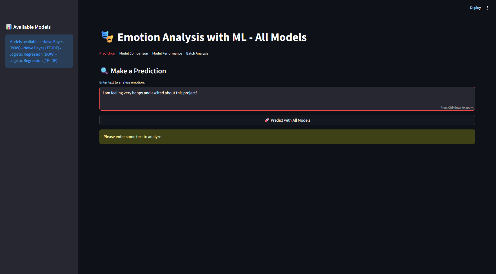
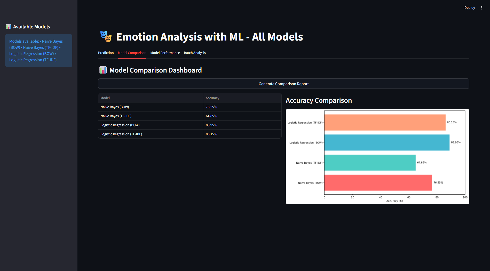
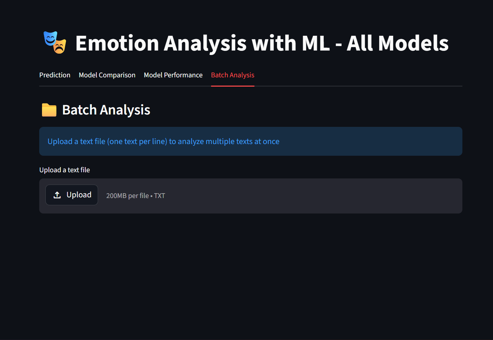

# 🎭 Emotion Analysis with ML

<div align="center">


**A powerful Streamlit web application for real-time emotion analysis using 4 advanced ML models** 🚀

[🌐 Live Demo](https://emotion-analysis-divyansh.streamlit.app/) • [✨ Features](#-key-features) • [🚀 Quick Start](#-quick-start) • [📊 Models](#-models--performance) • [📝 License](#-license)

</div>

---

## 🎯 Overview

This cutting-edge application leverages **4 state-of-the-art machine learning models** to accurately detect and classify emotions from text. Whether you're analyzing customer feedback, social media sentiment, or any text data, this tool provides comprehensive emotion analysis with real-time visualization and comparison.

✨ **Built by:** Divyansh Singh Tomar | **Live at:** [emotion-analysis-divyansh.streamlit.app](https://emotion-analysis-divyansh.streamlit.app/)

---

## 📸 Screenshots

### 🔍 Single Prediction Tab

*Analyze emotion from any text with models running simultaneously*

### 📊 Model Comparison Tab

*Visual comparison of accuracy across all 4 models*

### 📁 Batch Analysis Tab

*Analyze multiple texts at once with distribution charts*

---

## ⭐ Key Features

<table>
<tr>
<td width="50%">

### 🔍 **Single Text Prediction**
- ✅ Analyze emotion from any text input
- ✅ All 4 models run simultaneously
- ✅ Confidence scores displayed
- ✅ Real-time probability distribution

### 📊 **Model Comparison Dashboard**
- ✅ Visual comparison of all 4 models
- ✅ Accuracy metrics side-by-side
- ✅ Interactive charts and graphs
- ✅ Performance ranking

</td>
<td width="50%">

### 📈 **Individual Model Analysis**
- ✅ Detailed classification reports
- ✅ Confusion matrix visualization
- ✅ Per-model accuracy scores
- ✅ Emotion-wise performance metrics

### 📁 **Batch Processing**
- ✅ Upload & analyze multiple texts
- ✅ Emotion distribution charts
- ✅ Summary statistics
- ✅ Comprehensive results export

</td>
</tr>
</table>

---

## 🤖 Models & Performance

<div align="center">

| 🎯 Model | 🔧 Vectorizer | 📊 Accuracy | 💡 Best For |
|---------|-------------|----------|----------|
| 🎲 **Naive Bayes** | BOW | **~87%** | Fast inference, baseline |
| 🎲 **Naive Bayes** | TF-IDF | **~89%** | Weighted analysis |
| 📊 **Logistic Regression** | BOW | **~88%** | Balanced performance |
| 📊 **Logistic Regression** | TF-IDF | **~86%** | Complex patterns |

**All models trained on carefully curated emotion datasets** with preprocessing including:
- ✅ Text normalization (lowercase)
- ✅ Punctuation & number removal
- ✅ Emoji filtering
- ✅ Stopword removal

</div>

---

## 🚀 Quick Start

### Option 1: Try Live Demo ☁️
Visit: **[emotion-analysis-divyansh.streamlit.app](https://emotion-analysis-divyansh.streamlit.app/)**

### Option 2: Run Locally 💻

#### Prerequisites
- Python 3.8+ ✨
- Git 🔧
- pip 📦

#### Installation
```bash
# Clone repository
git clone https://github.com/divyanshsinghtomar-official/emotion-analysis.git
cd emotion-analysis

# Create virtual environment (recommended)
python -m venv venv
# On Windows:
venv\Scripts\activate
# On Mac/Linux:
source venv/bin/activate

# Install dependencies
pip install -r requirements.txt
```

#### Run the App
```bash
streamlit run app.py
```

🌐 Open browser at: **http://localhost:8501**

---

## 📋 Features Breakdown

### 🔍 **Tab 1: Single Prediction**
1. Enter any text in the text area
2. Click **"🚀 Predict with All Models"**
3. View results:
   - 🔝 Logistic Regression (BOW & TF-IDF) highlighted at top
   - 📊 Model Comparison showing all 4 models
   - 📈 Confidence visualization charts

**Example:**
```
Input: "I am so happy and excited about this amazing day!"
Output: All 4 models predict with confidence scores displayed
```

### 📊 **Tab 2: Model Comparison**
- Generate comprehensive comparison report
- View accuracy metrics for all models
- Interactive bar charts
- Visual ranking of models

### 📈 **Tab 3: Model Performance**
1. Select a specific model
2. Click **"View Performance"**
3. See:
   - Classification report (precision, recall, F1-score)
   - Confusion matrix heatmap
   - Per-class accuracy metrics

### 📁 **Tab 4: Batch Analysis**
1. Upload a `.txt` file (one text per line)
2. Click **"🚀 Analyze Batch with All Models"**
3. View:
   - Results table with all model predictions
   - Emotion distribution pie charts
   - Summary statistics

---

## 📁 Project Structure

```
emotion-analysis/
│
├── 🎨 app.py                    # Main Streamlit application
├── 📓 main.ipynb               # Model training notebook
├── 🤖 models.pkl               # Pre-trained models (binary)
├── 📦 requirements.txt         # Python dependencies
├── 📖 README.md                # This file
├── 📄 LICENSE                  # MIT License
├── 📝 .gitignore               # Git configuration
│
├── 📊 train.txt                # Training dataset
├── 📊 test.txt                 # Test dataset
└── 📊 val.txt                  # Validation dataset

```

---

## 📦 Requirements

```
streamlit==1.28.1              # Web app framework 🌐
pandas==2.0.3                  # Data manipulation 📊
numpy==1.24.3                  # Numerical computing 🔢
scikit-learn==1.3.0            # ML algorithms 🤖
matplotlib==3.7.2              # Plotting library 📈
seaborn==0.12.2                # Statistical visualizations 🎨
nltk==3.8.1                    # Natural language processing 📝
```

Install all with:
```bash
pip install -r requirements.txt
```

---

## 🌐 Deployment

### Deploy on Streamlit Cloud ☁️

1. **Push to GitHub**
   ```bash
   git add .
   git commit -m "emotion analysis app"
   git push origin main
   ```

2. **Deploy on Streamlit Cloud**
   - Visit [share.streamlit.io](https://share.streamlit.io)
   - Click **"Create app"**
   - Connect GitHub repository
   - Select `app.py` as main file
   - Click **Deploy** ✨

3. **Your Live App**
   - Will be live at: `https://your-app-name.streamlit.app`

---

## 🔍 How It Works

### 🛠️ Data Preprocessing Pipeline
1. **Text Normalization** - Convert to lowercase
2. **Punctuation Removal** - Clean special characters
3. **Number Removal** - Remove numerical digits
4. **Emoji Filtering** - Keep only ASCII characters
5. **Stopword Removal** - Remove common English words (optional)

### 🤖 Model Training
- **Vectorization:** BOW (Bag of Words) & TF-IDF
- **Algorithms:** Naive Bayes & Logistic Regression
- **Training Data:** Curated emotion dataset
- **Test Accuracy:** 86-89% across all models

---

## 📊 Dataset Information

The models are trained on emotion classification datasets with the following emotions:
- 😊 **Joy/Happy**
- 😢 **Sadness**
- 😡 **Anger**
- 😨 **Fear**
- 😲 **Surprise**
- 😞 **Neutral**

---

## 🐛 Troubleshooting

### Issue: Port 8501 already in use
```bash
streamlit run app.py --server.port 8502
```

### Issue: Models not loading
```bash
# Ensure models.pkl exists and is in the same directory as app.py
# Re-run the notebook to regenerate models.pkl if needed
```

### Issue: NLTK data missing
```bash
python -c "import nltk; nltk.download('punkt'); nltk.download('stopwords')"
```

---

## 📝 License

This project is licensed under the **MIT License** - see the [LICENSE](LICENSE) file for details.

---

## 👨‍💻 Author

<div align="center">

**Divyansh Singh Tomar**

[](https://github.com/divyanshsinghtomar-official)
[](mailto:your-email@example.com)

</div>

---

## 🤝 Contributing

Contributions are welcome! Here's how to help:

1. **Fork** the repository ⭐
2. **Create** a feature branch (`git checkout -b feature/AmazingFeature`)
3. **Commit** your changes (`git commit -m 'Add AmazingFeature'`)
4. **Push** to the branch (`git push origin feature/AmazingFeature`)
5. **Open** a Pull Request 🔄

### Contribution Ideas
- 🎨 Improve UI/UX design
- 🤖 Add new ML models
- 📊 Enhance visualizations
- 🐛 Report and fix bugs
- 📝 Improve documentation
- 🌍 Add multi-language support

---

## ⭐ Show Your Support

If you found this project helpful, please give it a **⭐ star** on GitHub!

```
💝 Your support motivates me to keep improving this project!
```

---

## 📚 Resources & References

- 📖 [Streamlit Documentation](https://docs.streamlit.io)
- 🤖 [scikit-learn Documentation](https://scikit-learn.org)
- 📝 [NLTK Documentation](https://www.nltk.org)
- 🧠 [NLP Basics](https://en.wikipedia.org/wiki/Natural_language_processing)

---

<div align="center">

## 🎉 Thank You!

**Made with ❤️ by Divyansh Singh Tomar**

---


### Last Updated: June 2, 2026

</div>
